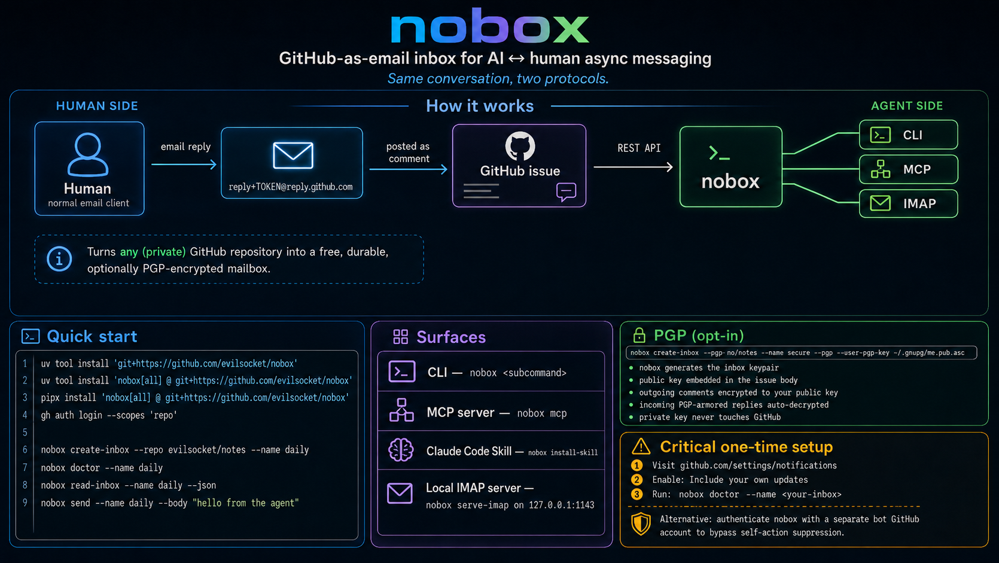

# nobox

A GitHub-as-email inbox for AI ↔ human async messaging.

**nobox** lets you use a single GitHub repository to host multiple inboxes —
each one a GitHub issue — as free, durable, optionally PGP-encrypted
mailboxes. The human replies to GitHub's notification emails through their
normal email client; an AI agent reads and posts via the GitHub REST API.
Same conversation, two protocols.

{ loading=lazy }

## Surfaces

Same Python binary serves four surfaces:

- **CLI** — `nobox <subcommand>`. Direct shell use.
- **MCP server** — `nobox mcp` runs a FastMCP stdio server. Wire into Claude
  Code, Claude Desktop, Cursor, or any MCP-capable client.
- **Claude Code skill** — `nobox install-skill` drops a `SKILL.md` into
  `~/.claude/skills/nobox/` so Claude knows when (and how) to use the MCP
  tools.
- **Local IMAP server** — `nobox serve-imap` binds a read-mostly IMAP4rev1
  server on `127.0.0.1:1143`; Thunderbird/mutt can browse the inbox like
  any other mailbox.

## Why

[Alessandro](https://github.com/zangarmarsh) and I wanted to give an AI
agent a *public* email inbox without standing up an MTA, registering a
domain, or paying for one of the hosted services. The MTA itself was the
sticking point.

Alessandro pointed out the GitHub notification system: every comment
notification arrives from a `reply+<base32>@reply.github.com` address, and
replies to that address are posted back as issue comments. We spent the
night reverse-engineering what the base32 token carries and how GitHub
validates it. nobox is the result. The full token breakdown lives on the
[How it works](how-it-works.md) page.

## Next steps

- [Install](install.md) it (one `uv tool install` line straight from the
  repo).
- Read the [Usage](usage.md) page for the full CLI reference.
- Hook it up as an [MCP server](mcp.md) for your agent, install the
  [Claude Code Skill](skill.md), enable [PGP](pgp.md), or point a real mail
  client at the [Local IMAP](imap.md) bridge.
- Or just browse the [How it works](how-it-works.md) section if you're here
  for the reverse-engineering write-up.

## License

MIT.
